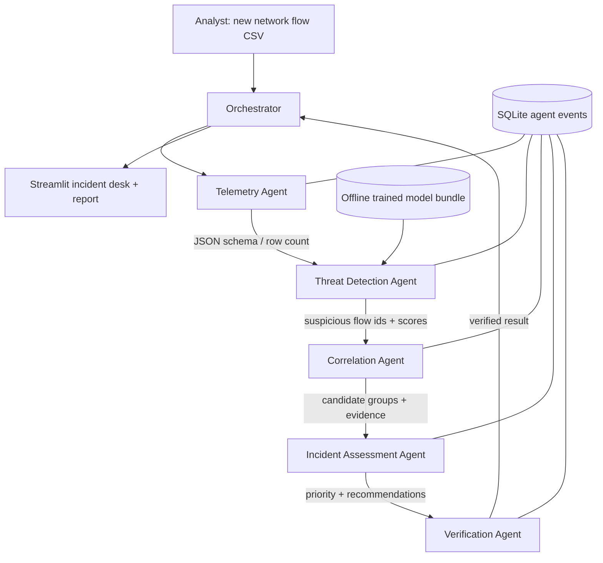

# Architecture

## Value proposition
The SOC analyst uploads **unlabeled new telemetry**; the platform returns an evidence-linked candidate incident queue and a JSON / HTML report. Offline model training is a developer-only preparation step, never part of the user workflow.

## Data flow

## Formal agent specification

| Agent | Input | Output | Tools (at most 5) | Stop condition |
|---|---|---|---|---|
| Telemetry | flow CSV | normalized in-memory table; JSON envelope | CSV reader | valid nonempty dataset or clear error |
| Threat Detection | table, trusted bundle | scored rows, JSON summary | model prediction, predicted class probabilities | predictions per row or schema error |
| Correlation | scored rows | bounded candidate incident groups, JSON summary | event grouper | all positive predictions grouped with valid row IDs |
| Incident Assessment | candidate groups | risk-prioritized candidates and review recommendations | risk ranker | every group has assigned priority |
| Verification | candidates, scored rows | evidence checks, pass/fail | evidence verifier | all candidates verified or failed |
| Orchestrator (not worker) | analyst request | stored report | routing only | workflow completed or exception logged |

## Protocol
`{message_id, run_id, sender, receiver, time, payload}` for every hop; SQLite `events` records all `message` and `tool_call` entries and persists a final JSON report in `reports`. Python orchestrator bounds rows to 100k and agents are acyclic, so there is no unlimited recursion.

## Meaningful multi-agent collaboration
Each worker changes the shared investigation: validated source → scored flows → correlated candidates → prioritized cases → verified evidence. Correlation may elect **not** to create multi-flow incidents if entity identifiers are missing. Verification does not simply reproduce ML predictions, instead it checks underlying row references and evidence constraints.

## Honest gaps before maximum rubric score
- No true agent-autonomous planning or LLM-assisted analysis. This is a bounded, auditable agent-oriented ML system.
- No retry policy or per-agent timeout yet.
- Cross-format ingestion only when training and inference share exact feature schemas.
- No guarantee of ≤40% across every scenario: the actual shares are calculated and shown.
- Official dataset not bundled: verify on real benchmark externally before making empirical claims.
- Source code is local; student should push the folder to their own Git repository.

## Defense talking points
A traditional ML benchmark measures held-out classifications; this project adds **incident-level work** for security analysts: source evidence, correlation restrictions, severity triage, validation and auditable messages. A detector score is not evidence of an actual compromise and IP-based correlation is a heuristic.
